# Developing C or C++ Apps on Raspberry Pi with Visual Studio Code Remote SSH

| Visual Studio Code | Hack on Raspberry Pi  | Build Industrial IoT |
|---|---|---|
| 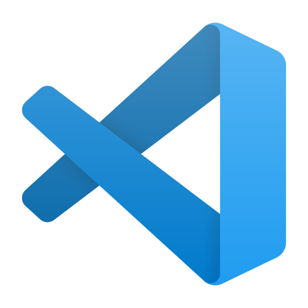 | 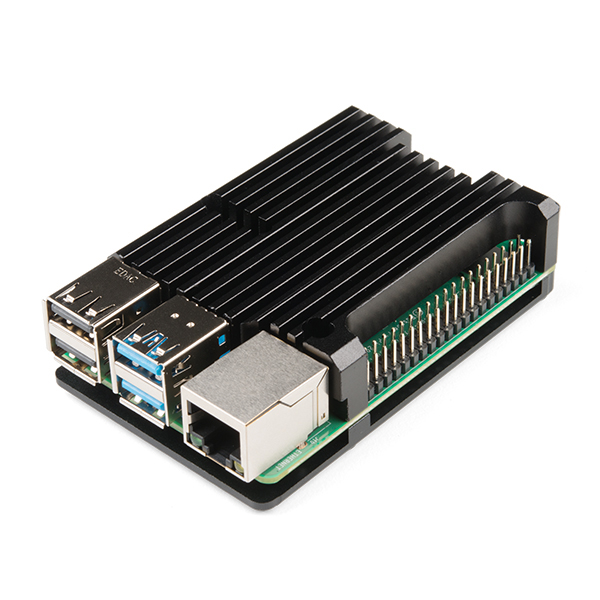 |   |

This tutorial targets Raspberry Pi 4 as it's such an awesome and capable device. This tutorial will also work on all modern Raspberry Pis, version 2 or better, except for the Raspberry Pi Zero (as it is not supported by Visual Studio Core Remote SSH Development).

---

## Introduction

There are two approaches to developing C/C++ applications for the Raspberry Pi. You can either cross-compile to the ARM processor architecture from your desktop computer, or you can build, compile, and debug on the Raspberry Pi itself.

Visual Studio 2019 (inc free of charge Community Edition) includes tools to develop, cross-compile, copy the app to the Raspberry Pi and remotely attach the GDB debugger. It's a great option but it is Windows only.

This tutorial explores using Visual Studio Code from macOS, Linux, or Windows to build C/C++ applications on the Raspberry Pi itself.

The following is a guide to C/C++ development on a Raspberry Pi with Visual Studio Code. At the time of writing the Microsoft [C/C++](https://marketplace.visualstudio.com/items?itemName=ms-vscode.cpptools) Visual Studio Code extension does not support ARM based systems.

The Raspberry Pi is a great learning platform for C and C++ development.  Interesting enough, C and C++ are one of the fastest growing languages still. This article [5 REASONS WHY YOU SHOULD KEEP LEARNING C/C++](https://www.topcoder.com/5-reasons-keep-learning-c/) covers the great reasons why you should be learning C and C++.

---

## Raspberry Pi set up

1. Set up your Raspberry Pi
2. Ensure Operating System updated
3. [Raspberry Pi set up tips and tricks](RPISETUPTIPS.md)

---

## Raspberry Pi development libraries

Install the following libraries on the Raspberry Pi from the command line.

```bash
sudo apt install cmake clang clang-format cppcheck global build-essential gdb git wiringpi
```

---

## Visual Studio Code Extensions

1. [Visual Studio Code Remote - SSH](https://marketplace.visualstudio.com/items?itemName=ms-vscode-remote.remote-ssh)
2. [C/C++ Clang Command Adapter](https://marketplace.visualstudio.com/items?itemName=mitaki28.vscode-clang)
3. [CMake Tools](https://marketplace.visualstudio.com/items?itemName=ms-vscode.cmake-tools)
4. [Native Debug](https://marketplace.visualstudio.com/items?itemName=webfreak.debug)
5. [C/C++ Snippets](https://marketplace.visualstudio.com/items?itemName=hars.CppSnippets)
6. [C/C++ Advanced Lint](https://marketplace.visualstudio.com/items?itemName=jbenden.c-cpp-flylint)
7. [C Snippets](https://marketplace.visualstudio.com/items?itemName=Harry-Ross-Software.c-snippets)
8. [Clang-Format](https://marketplace.visualstudio.com/items?itemName=xaver.clang-format)

---

## Clone this tutorial to your computer

Clone this project to your computer as you will need to run a script to set up SSH authentication between your computer and your Raspberry Pi.

```bash
git clone --depth=1 https://github.com/gloveboxes/Raspberry-Pi-with-Visual-Studio-Code-Remote-SSH-and-C-or-C-Development.git
```

---

## Set up SSH Authentication between your computer and Raspberry Pi


Setting up a public/private key pair for [SSH](https://en.wikipedia.org/wiki/Secure_Shell) authentication is a secure and fast way to authenticate from your computer to the Raspberry Pi. This is recommended for this hands-on lab.

### Set up SSH for Windows Users

The SSH utility guides you through the process of setting up a secure SSH channel for Visual Studio Code and the Raspberry Pi.

You will be prompted for:

- The Raspberry Pi Network IP Address,
- The Raspberry Pi login name and password. The Raspberry Pi **default** login name is **pi**, and the default password is **raspberry**.

1. From Windows File Explorer, open the directory you cloned this tutorial into.
2. Open the **scripts** folder
3. Double click the **windows-setup-ssh.cmd**

### Set up SSH for Linux and macOS Users

The SSH utility guides you through the process of setting up a secure SSH channel for Visual Studio Code and the Raspberry Pi.

You will be prompted for:

- The Raspberry Pi Network IP Address,
- The Raspberry Pi login name and password

1. Open a Terminal window
2. Navigate to the directory you cloned this tutorial into.
3. Open the **scripts** folder.
4. Grant execute privileges to ssh-setup.sh.
    ```bash
    sudo chmod +x ssh-setup.sh
    ```
5. run the ssh-setup script
    ```bash
    ./ssh-setup.sh
    ```

---

## Start a Remote SSH Connection

1. Start Visual Studio Code
2. Press **F1** to open the Command Palette, type **ssh connect** and select **Remote-SSH: Connect to Host**

3. Select the **pylab-pi** configuration
    <br/>

    

    <br/>
4. Check the Remote SSH has connected.

    It will take a moment to connect, then the SSH Status in the bottom lefthand corner of Visual Studio Code will change to **>< SSH:pylab-pi**.
    <br/>

    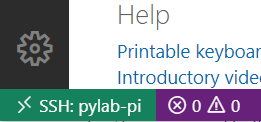

---

## Create a new project directory

1. First, create a folder for your project
2. From the Visual Studio Code menu select **Terminal** -> **New Terminal**.
3. From the Raspberry Pi Bash command prompt, create a directory structure for your project.  I like to keep projects in a directory named **github**. But this is just my preference as most projects I work on are either cloned from GitHub or are published on GitHub.

    ```bash
    mkdir -p ~/github
    ```

    Then create your C/C++ project directory.

    ```bash
    mkdir -p ~/github/your-project-name
    ```

    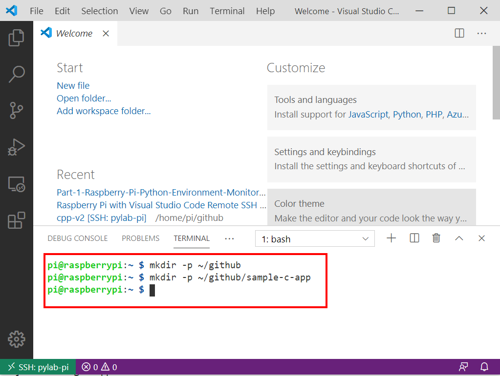

---

## Open the project directory with Visual Studio Code

1. From Visual Studio Code main menu, select **File** -> **pen Folder**. 

    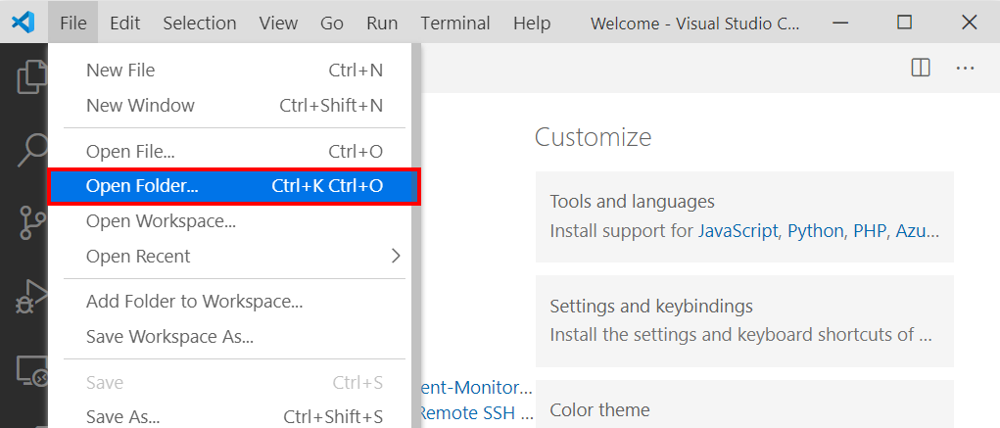

2. Navigate to the **github** folder.

    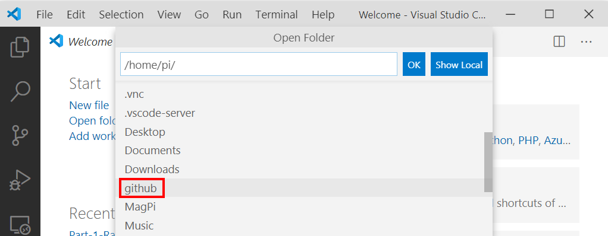

3. Navigate to the **project** directory you created.

    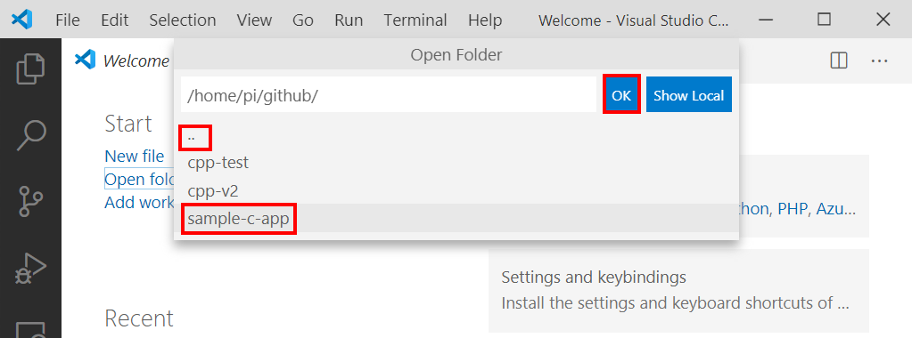

4. Click **OK**

> Tip: Click the double dots if you need to navigate back up the directory structure.

## Create the project structure

1. Press <kbd>F1</kbd> to open the Visual Studio Code command prompt.

    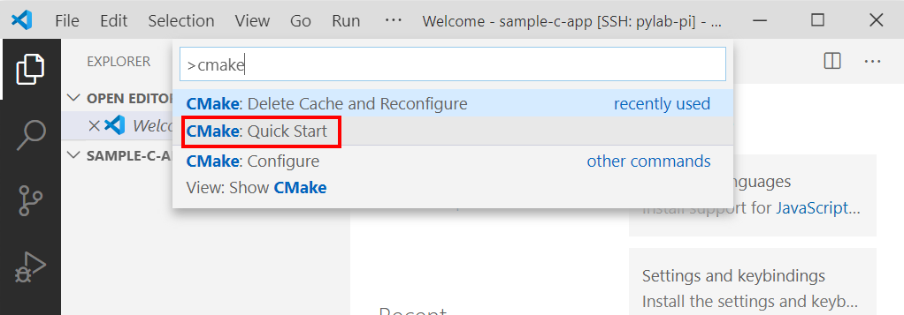

2. Select **CMake: Quick Start**

3. Select **Unspecified (Let CMake guess)** unless you have some specific requirements.

    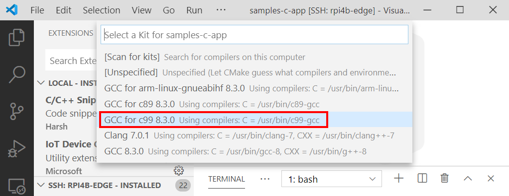

4. Name your project

    

5. Select **Executable** (or Library, if you know what you are doing).

6. The CMake project will be created and the CMake cache generated.

---

## C or C++

If you are planning on writing C++ then you are set. The project generated a main.cpp file for you.

If you are planning on writing a C application, then right mouse click the **main.cpp** file and rename main to **main.c** then open the **main.c** and replace the content with the following C code.

```c
#include <stdio.h>

int main(int argc, char *argv[])
{    
    for (int i = 0; i < 100; i++)
    {
        printf("%d\n", i);
    }
}

```

In this tutorial we are going to create a C application, so I've rename main.cpp to main.c.

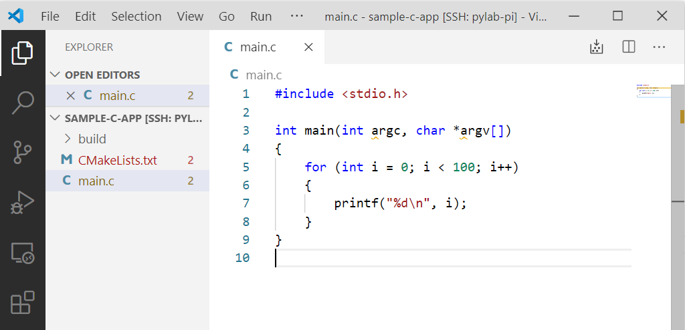
    
---

## Create Build, Run, Debug settings

As a convenience, the build and debug process uses the name of the project directory. We need to update the CMake file, and create a Launcher and Build Task.

### Update the CMake file

1. Open the CMakeList.txt file
2. Replace the existing contents with the following text. This CMake code sets the project name to the name of the project directory.

    ```cmake
    cmake_minimum_required(VERSION 3.13.0)

    get_filename_component(ProjectId ${CMAKE_CURRENT_LIST_DIR} NAME)
    string(REPLACE " " "_" ProjectId ${ProjectId})

    project(${ProjectId} VERSION 0.1.0)

    include(CTest)
    enable_testing()

    add_executable(${PROJECT_NAME} main.c)

    set(CPACK_PROJECT_NAME ${PROJECT_NAME})
    set(CPACK_PROJECT_VERSION ${PROJECT_VERSION})
    include(CPack)

    ```

## Create the Build Task

1. From the Visual Studio Code main menu, select **Terminal** -> **Configure Default Build Task**.

    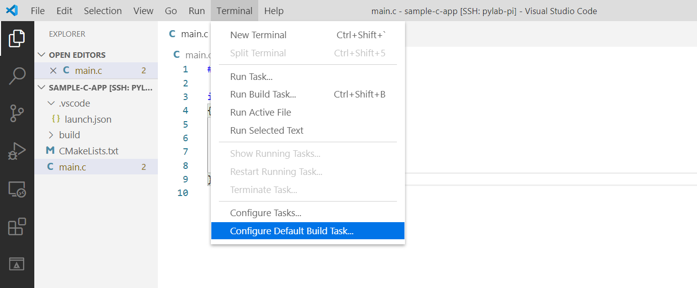

2. Select **Create tasks.json file from template** -> **Others**.
3. Replace the contents of the task.json file with the following. This creates a build task called **cmake**.

    ```json
    {
        // See https://go.microsoft.com/fwlink/?LinkId=733558
        // for the documentation about the tasks.json format
        "version": "2.0.0",
        "tasks": [
            {
                "label": "cmake",
                "type": "shell",
                "options": {
                    "cwd": "${workspaceRoot}/build"
                },
                "command": "cmake",
                "args": [
                    "--build",
                    "${workspaceRoot}/build",
                    "--config",
                    "Debug",
                    "--target",
                    "all",
                    "--",
                    "-j",
                    "6"
                ]
            }
        ]
    }
    ```

### Create a project Launcher

1. From the Visual Studio Code main menu, select **Run** -> **Add Configuration**.

    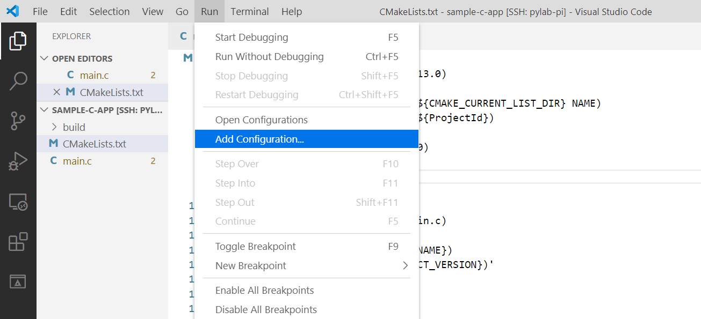

2. Select **GDB**

    

3. The launch.json file will open. 

    We are going to make the following two changes:
    
    1. Call the preLaunchTask named **cmake**.
    2. Change the **target** property so that it launches the CMake generated application. Remember, the application name matches the project directory name. The **${workspaceFolderBasename}** is a Visual Studio Code variable that contains the project directory name.

    Change the **target** property to read:

    ```json
    "target": "./build/${workspaceFolderBasename}"
    ```

    Add the preLaunchTask property to read:

    ```json
    "preLaunchTask": "cmake"
    ```

    The launch.json file should look like the following after you have updated it.

    ```json
    {
        // Use IntelliSense to learn about possible attributes.
        // Hover to view descriptions of existing attributes.
        // For more information, visit: https://go.microsoft.com/fwlink/?linkid=830387
        "version": "0.2.0",
        "configurations": [
            {
                "name": "Debug",
                "preLaunchTask": "cmake",
                "type": "gdb",
                "request": "launch",
                "target": "./build/${workspaceFolderBasename}",
                "cwd": "${workspaceRoot}",
                "valuesFormatting": "parseText"
            }
        ]
    }
    ```

4. Save the launch.json file

---

## Start the Application in Debug Mode

1. Open main.c
2. Put a breakpoint at line 5. With the mouse, click in the margin just to the left of line 5.

    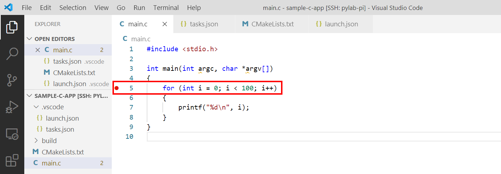

3. Press <kbd>F5</kbd> to start the build process, to launch the application, and to attach the debugger. The code will halt execution at line 5.

4. Using the Visual Studio Debug Toolbar, step through the code. You can either step through the code using the toolbar, or the shortcut keys. <kbd>F10</kbd> to step over a line, <kbd>F11</kbd> to step into a function.

    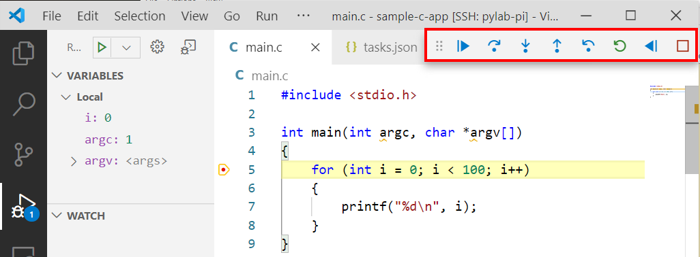

5. Remove the debug breakpoint by clicking on the red dot next to line 5.
6. Press <kbd>F5</kbd> to continue the execution of the application.
7. Switch to the Debug Console to see the output from the *printf* statement in the application.

    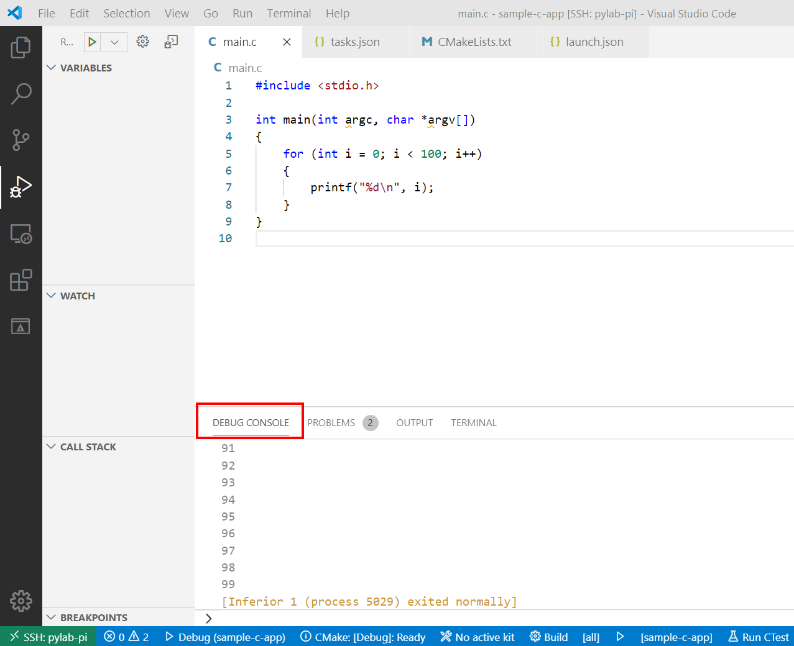

---

## CMake Tool options on the Visual Studio Code Status Bar

Be sure to check out the CMake options on the Visual Studio Code Status Bar.

You can change the build from **Debug** to **Release**, rebuild the project and run the application without attaching the debugger.


---

## Quick compile

In the top right hand corner of Visual Studio Code there is a **Compile Active File** button. 

---

## Adding more files to your CMake C or C++ Project

As tempting as it may be, don't put all your code into **main.c**. A well factored application should be split up by function.  

Here are the steps to add a new file to the project to have it compiled and included in your main.c file.

1. Create your .c and corresponding .h files. In my case, I've created a isoTime.c and an isoTime.h. Open the CMakeList.txt file and add the isoTime.c file to the **add_executable(${PROJECT_NAME} main.c isoTime.c)** line.
2. Save the the CMakeList.txt file. The CMake cache will be updated with the new build configuration.

See the sample-c-app project included with this tutorial.


## References

[Using C++ on Linux in VS Code](https://code.visualstudio.com/docs/cpp/config-linux)

[How to overclock Raspberry Pi 4](https://magpi.raspberrypi.org/articles/how-to-overclock-raspberry-pi-4)

---

<!-- ## Install Azure C SDK Dev Package

[Use apt-get to create a C device client project on Ubuntu](https://github.com/Azure/azure-iot-sdk-c/blob/master/doc/ubuntu_apt-get_sample_setup.md)

Add the AzureIoT repository to the machine:

```bash
sudo apt-get install -y software-properties-common
sudo add-apt-repository ppa:aziotsdklinux/ppa-azureiot
sudo apt-get update
```

Install the azure-iot-sdk-c-dev package

```bash
sudo apt-get install -y azure-iot-sdk-c-dev
``` -->

---

## MQTT C Client Installation

[MQTT C Client for Posix and Windows](https://www.eclipse.org/paho/clients/c/)

Install required openssl library header

[“openssl/ssl.h: No such file or directory” during Installation of Git](https://stackoverflow.com/questions/17915098/openssl-ssl-h-no-such-file-or-directory-during-installation-of-git)

```bash
sudo apt-get install libssl-dev
```
